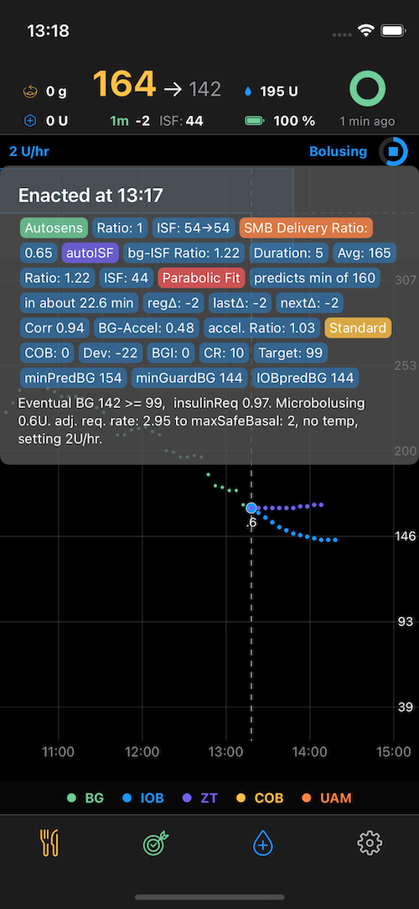

# FreeAPS X with aisf

Ivan's tremendous effort with FreeAPS X - supplemented with an adapted oref1 algo that is based on Gerhards work with his German community, especialy Bernd who trials and tweaks all parameters for himself and documents his structured progress quite well. Gerhard's oref adation and lots of documents and simulation programs for Android can be found at: https://github.com/ga-zelle/autoISF

I just tweaked this oref to work with FAX and JonB helped a lot getting all prefs sorted in FAX. The whole algorithm can be found in my oref repo: https://github.com/mountrcg/oref0/tree/xpm2.2
That will be more easy to review as the packeted js-files in FAX are not really readable. And I really suggest to look at the code.


## Changes to FAX

There needed to be some changes to the UI. I tried to keep them minimal.
- show ISF as the key parameter in this oref adaption in the header near current BG
- move the Enacted popup a bit further down to review Header info simultaneously
- make space for this and the eventual BG up there as well, so COB and IOB are small icons
- colors harmonized




With the Icicle commit basals are upside down as on Nightscout, just revert that commit for standard FAX basals: https://github.com/mountrcg/freeaps/commit/1c887ce20da738d4dc6e874d9c7193d6b59d05f4

Same applies to the Watch face that also shows ISF.

## Settings

You will loose most of your previous settings in FAX, all settings with pre-defined defaults are set back to those. This is to make sure you run through all relevant oref settings. All autoISF settings are by default set to not enable any features beyond standard oref. If you want to use autoISF you have to touch all parameters and there is a whole bunch of it.

Autosens and autoISF both manipulate sensitivityRatios and ISF. It is currently setup that the stronger sensitivityRatios win. In order to not get duplicating effects or contradicting effects, it is suggested to switch Autosens off by setting `profile.autosens_max = 1` and `profile.autosens_min = 1`, which is an absolute must if no carbs are logged, running in UAM only mode.

If you enter carbs and still want to have Autosens running alongside, at least *Sensitivity Raises Target* and *Resistance Lowers Targets* should to be switched off.

## Sports & autoISF

When exercising and raising sensitivity via *High TT Raises Sensitivity* or *Excercise Mode* you have to switch off autoISF, as it could send you in the opposite direction. It is easiest accomplished via middleware, that automaticall sets autoISF to off

``` js
function middleware(iob, currenttemp, glucose, profile, autosens, meal, reservoir, clock) {
	const high_temptarget_raises_sensitivity = profile.exercise_mode || profile.high_temptarget_raises_sensitivity;
	var reasonSports = "nothing to do.";

	if (high_temptarget_raises_sensitivity && profile.temptargetSet && profile.min_bg > 110) {
		profile.use_autoisf = false;
		reasonSports = "autoISF off due to Exercise Target. ";
	}
	return reasonSports
}
```

## Middleware

Oh jesus you can do all sorts of things with it. Be careful it is very mighty to test or automate certain things. As a drawback it circumvents all safety measures of oref. If you calculate a sensitivityRatio of 10 it will be passed on to oref and be used resulting in pushing 10x the insulin you would normally require. I use to test middleware on the simulator in xcode as you can run loops/calcs anytime, there are no time restriction for long-pressing the loop circle. So great for testing all kind of things.

Here an example for a more complex middleware, in which you can switch on and off certain features.

``` js
function round(value, digits)
{
    if (! digits) { digits = 0; }
    var scale = Math.pow(10, digits);
    return Math.round(value * scale) / scale;
}

function middleware(iob, currenttemp, glucose, profile, autosens, meal, reservoir, clock) {
	//enable SMB at night with High Targets and disable after 6am
	var nightlySMBHT = true;

	//increase insulin output with raising BG
	var accelerateUAM = false;
	const limit1 = 160;
	const factor1 = 1.1;
	const limit2 = 190;
	const factor2 = 1.3;
	const limit3 = 220;
	const factor3 = 1.4;
	const IOBlimit = 6.5;

	//set a percentage profile
	var override = false;
	const overridevalue = 0.8;

	//do Spocks magic formula
	var spock = false;
	const TDD = 45;
	const minRatioLimit = profile.autosens_min;
	const maxRatioLimit = profile.autosens_max;

	//--------------------------------------------

    const hours = clock.getHours();
    const lastGlucose = glucose[0].sgv;
    const lastIOB = iob[0].iob;
    var reason1 = "No UAM acceleration. ";
    var reason2 = "No override. ";
	var reasonIOB = "IOB is in bounds";
    var reasonSMB = "Nightly SMB-Logic disabled. ";
	var reasonSpock = "Spock is off. ";
	var reasonSports  = "";
    var newRatio = autosens.ratio;
    var overrideRatio = newRatio;

	// Turn off AutoISF when using a exercise mode and a high target
	var high_temptarget_raises_sensitivity = profile.exercise_mode || profile.high_temptarget_raises_sensitivity;
	if (high_temptarget_raises_sensitivity && profile.temptargetSet && profile.min_bg > 110) {
		profile.use_autoisf = false;
		reasonSports = "autoISF off due to Exercise Target. ";
		spock = false;
		reasonSpock = "Spock's magic off due to High Target. ";
	}

	// Turn SMB`s with High targets on during nights
    if (nightlySMBHT=true) {
        if (hours >= 0 && hours <= 6) {
            profile.allowSMB_with_high_temptarget = true;
            reasonSMB = "SMB with HT enabled due to nighttime. "
            }else{
                profile.allowSMB_with_high_temptarget = false
                reasonSMB = "SMB with HT disabled due to daytime. "
            }
        }

	// increase ISF BG level related to boost UAM - not necessary with autoISF, just testing
    if (accelerateUAM == true && hours >= 6 && hours <= 23) {
        if (lastGlucose > limit3) {
            newRatio = autosens.ratio * factor3;
        }else{
            if (lastGlucose > limit2) {
                newRatio = autosens.ratio * factor2;
                }else{
                if (lastGlucose > limit1) {
                    newRatio = autosens.ratio * factor1;
                }
            }
          }
        autosens.ratio = newRatio;
        if (lastIOB > IOBlimit) {
            profile.enableSMB_always = false;
            reasonIOB = ", SMB disabled with IOB=" + lastIOB + ". ";
        }
        reason1 = "Ratio set to " + autosens.ratio + " as last glucose value is " + lastGlucose + ". "+ reasonIOB + "."
    }

	// Loop like overrides, but not saved on pump
    if (override==true) {
        overrideRatio = overridevalue;
        autosens.ratio = overrideRatio;
        reason2 =  "Profile override set to " + autosens.ratio*100+"%.";
    }

	// Mr.Spock has the bridge
  	if (spock==true) {
		SpockRatio = profile.sens / (277700 / (TDD * lastGlucose));
		if (SpockRatio > maxRatioLimit) {
			SpockRatio = maxRatioLimit;
			reasonSpock = "Spock's magic hit limit by autosens_max setting: " + maxRatioLimit;
		}
		if (SpockRatio < minRatioLimit) {
			SpockRatio = minRatioLimit;
			reasonSpock = "Spock's magic hit limit by autosens_min setting: " + minRatioLimit;
		}
		autosens.ratio = round(SpockRatio,3);
		reasonSpock = "Spock's Ratio @ " + round(SpockRatio,3) + " with ISF:"  + round(profile.sens/SpockRatio,0);
	}

	// end function and supply log output
	return `${reasonSports} ${reason1} ${reason2} ${reasonSMB} ${reasonSpock}`
}
```

## Documents

- read all the stuff in this folder: https://github.com/mountrcg/freeaps/tree/dev-aisf/aisf


